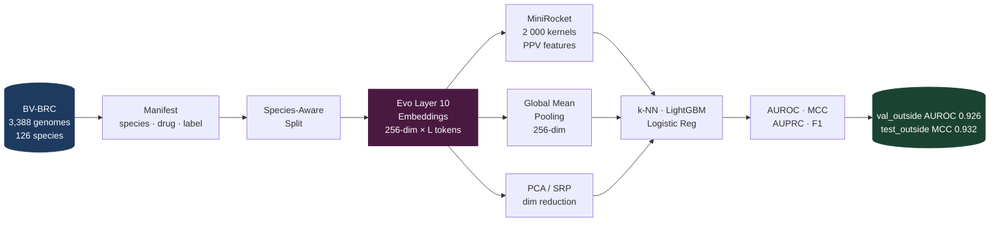

# Evo-AMR

[](https://www.python.org/)
[](https://pytorch.org/)
[](tests/)
[](LICENSE)
[](docs/cross_species_amr_prediction_thesis.pdf)

**Cross-species antimicrobial resistance prediction from genomic foundation model representations.**

Evo-AMR benchmarks [Evo-1-8k-base](https://github.com/evo-design/evo) embeddings against classical AMR baselines under strict species-holdout evaluation — revealing cross-species generalization that same-species splits systematically hide.

---

## Pipeline



---

## Key Findings

| Setting | Aggregation | Classifier | AUROC | MCC |
|---|---|---|---|---|
| **val_outside** | MiniRocket | k-NN | **0.926** | **0.753** |
| val_outside | Global Pool | k-NN | 0.515 | 0.148 |
| **test_outside** | Global Pool | LightGBM | — | **0.997** |
| test_outside | MiniRocket | k-NN | — | 0.956 |

> **MiniRocket preserves local cassette-scale ordering** — critical for plasmid/integron resistance mechanisms. Global pooling remains competitive for chromosomal/diffuse resistance. Aggregation choice is mechanism-dependent.

---

## Species-Holdout Evaluation Design

The experiment uses five strictly disjoint partitions to expose cross-species generalization:

| Partition | Species overlap with train | Purpose |
|---|---|---|
| `train` | — | Model fitting |
| `val_overlapped` | Yes | In-distribution validation |
| `val_outside` | **No** | Cross-species generalization signal |
| `test_overlapped` | Yes | In-distribution final evaluation |
| `test_outside` | **No** | Cross-species final evaluation |

Same-species splits inflate AUROC by ~47 points for the weakest aggregation strategy.

---

## Evo Layer Selection

Evo-1-8k-base is a 32-layer Hyena SSM trained on 2.7T nucleotides at single-nucleotide resolution. Layer-wise activation diagnostics show a **stability boundary at Layer 11**: norm variance spikes, making Layer 10 the deepest jointly stable extraction layer.

```python
from evo_hidden import extract_layer_hidden_states

embeddings = extract_layer_hidden_states(
    sequences=["ATGCGATCGATCG..."],
    layer=10,
    model_name="togethercomputer/evo-1-8k-base",
    device="cuda",
)
# → np.ndarray of shape (n_seqs, seq_len, 256)
```

The `evo-hidden` extraction package is published separately at [haleyyy2001/evo-hidden](https://github.com/haleyyy2001/evo-hidden).

---

## Classical Baselines

| Baseline | Strategy | Input |
|---|---|---|
| Kover | Set-cover / CART | k-mer presence/absence |
| ResFinder | Rule-based | Resistance gene database |
| PhenotypeSeeker | k-mer ML | Raw k-mer frequencies |
| Seq2Geno | Gene-presence | Pangenome features |
| Aytan-Aktug | CNN | Sequence |
| Majority vote | Trivial | Label distribution |

---

## Repository Layout

```text
Evo-Amr/
├── src/evo_amr/                    # Clean framework: Protocols, registries, adapter stubs
│   ├── data/                       #   Dataset → Manifest stage
│   ├── splits/                     #   Manifest → Split stage
│   ├── embeddings/                 #   Embedding extraction
│   ├── features/                   #   Feature aggregation (MiniRocket, pool, PCA)
│   ├── models/                     #   Classifier wrappers
│   ├── evaluation/                 #   AUROC / MCC / grouped metrics
│   ├── baselines/                  #   Classical AMR baseline drivers
│   ├── reporting/                  #   Markdown report generation
│   ├── workflows/                  #   End-to-end workflow orchestration
│   └── cli.py                      #   evo-amr entry point
│
├── research/                       # Full research pipeline code
│   ├── embedding/                  #   Evo embedding extraction CLI and HDF5 batching
│   ├── minirocket/                 #   MiniRocket, SRP, PCA classification pipelines
│   ├── models/                     #   Evo architecture wrappers and local model loading
│   ├── preprocessing/              #   Species balancing and subset extraction scripts
│   ├── diagnostics/                #   Layer-wise SLURM diagnostics
│   └── scripts/                    #   Dataset analysis utilities
│
├── config/                         # Runtime config system (paths.yaml, config_manager.py)
├── configs/                        # Example configs (dataset, baseline, experiment, SLURM)
├── docs/                           # Thesis PDF, architecture, experiment design, results
├── examples/                       # Tiny manifest, fake run outputs, example experiment YAML
├── tests/                          # 53 lightweight CI tests (no GPU, no private data)
├── utils/                          # Shared logging, I/O, and validation helpers
└── setup.py                        # Installable package + evo-amr / evo-embed / evo-minirocket CLIs
```

Large datasets, HDF5 embeddings, checkpoints, and results are excluded from git. Configure their locations in `config/paths.yaml`.

---

## Quick Start

```bash
git clone https://github.com/haleyyy2001/Evo-Amr.git
cd Evo-Amr

python3 -m venv .venv && source .venv/bin/activate
pip install --upgrade pip
pip install -r requirements.txt
pip install -e .
```

For GPU inference, install the CUDA-matched PyTorch build before the project dependencies.

### Dry-run the pipeline (no data required)

```bash
evo-amr train    --config examples/example_experiment.yaml
evo-amr report   --config configs/experiments/evo_minirocket_ampicillin.example.yaml
evo-amr list-pipelines
evo-amr list-baselines
```

### Run tests

```bash
pytest                    # 53 tests, ~seconds, no GPU needed
```

---

## Configuration

Edit `config/paths.yaml`:

```yaml
base_dir: "/path/to/Evo-Amr"
data_dir: "/path/to/amr/data"

data:
  sequences: "${data_dir}/sequences/raw/nucleotide"
  processed_embedding: "${data_dir}/processed_embedding"
```

SLURM job configs live in `configs/slurm/`. Example experiment configs are in `configs/experiments/`.

---

## Documentation

| Doc | Contents |
|---|---|
| [Thesis PDF](docs/cross_species_amr_prediction_thesis.pdf) | Full research writeup |
| [Research summary](docs/research_summary.md) | Condensed results and findings |
| [Experiment design](docs/experiment_design.md) | Split design, evaluation protocol |
| [Architecture](docs/architecture.md) | Module dependency map |
| [Codebase inventory](docs/codebase_inventory.md) | Per-script pipeline stage mapping |
| [Migration map](docs/migration_map.md) | Legacy → `src/evo_amr/` migration status |
| [Reproducibility notes](docs/reproducibility_notes.md) | HPC environment, data access |

---

## Project Status

Active research repository. The `src/evo_amr/` package provides clean Protocol interfaces and migration adapters; the historical `prediction/` and `benchmarking/` systems are being incrementally migrated into it.

## License

MIT — see [LICENSE](LICENSE).
